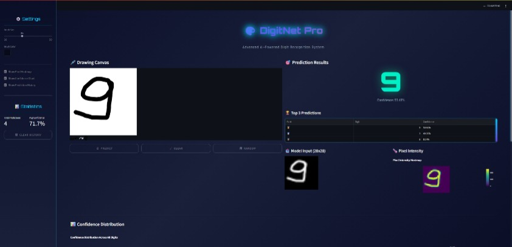

# 🎨 DigitNet Pro - AI-Powered Digit Recognition

[](https://www.python.org/downloads/)
[](https://streamlit.io/)
[](https://www.tensorflow.org/)
[](LICENSE)

**DigitNet Pro** is an advanced AI-powered application that recognizes handwritten digits using deep learning. Draw any digit from 0-9 on the interactive canvas, and our Convolutional Neural Network (CNN) will predict what digit you've drawn with confidence scores.

## 🖼️ Application Preview



## 🌟 Features

- **Interactive Drawing Canvas**: Draw digits with customizable brush sizes and colors
- **Real-time AI Prediction**: Instant recognition of handwritten digits
- **Confidence Visualization**: See confidence scores for all possible digits
- **Pixel Heatmap**: Visualize the intensity of your drawing
- **Prediction History**: Track your last 100 predictions with statistics
- **Responsive Design**: Works on both desktop and mobile devices
- **Modern UI**: Sleek dark theme with animated elements and glowing effects

## 🚀 Quick Start

### Prerequisites

- Python 3.8 or higher
- pip (Python package installer)

### Installation

1. Clone or download this repository:
   ```bash
   git clone <repository-url>
   cd DigitNet
   ```

2. Install the required dependencies:
   ```bash
   pip install -r requirements.txt
   ```
   
   Or install packages manually:
   ```bash
   pip install streamlit tensorflow numpy pillow plotly pandas
   ```

3. Run the application:
   ```bash
   streamlit run app.py
   ```

4. The app will automatically open in your default web browser. If not, navigate to `http://localhost:8501`

## 🎯 How to Use

1. **Draw a Digit**: Use your mouse or touchscreen to draw a digit (0-9) on the canvas
2. **Adjust Settings**: Customize brush size and color in the sidebar
3. **Predict**: Click the "🔮 Predict" button to analyze your drawing
4. **View Results**: See the predicted digit with confidence percentage
5. **Explore Visualizations**: Check the confidence chart and pixel heatmap
6. **Review History**: View your prediction history in the sidebar

### Control Buttons

- **🔮 Predict**: Analyze your drawing
- **🧹 Clear**: Clear the canvas and start over
- **🎲 Random**: Load a random sample from the MNIST dataset

## 🧠 Technology Stack

- **Frontend**: [Streamlit](https://streamlit.io/) - For creating the web interface
- **AI/ML**: [TensorFlow/Keras](https://www.tensorflow.org/) - For building and training the CNN
- **Visualization**: [Plotly](https://plotly.com/python/) - For interactive charts
- **Image Processing**: [Pillow](https://python-pillow.org/) - For image manipulation
- **Data Handling**: [Pandas](https://pandas.pydata.org/) - For data processing

## 🏗️ Architecture

The application uses a Convolutional Neural Network trained on the MNIST dataset:

```
Input (28x28 grayscale) → 
Conv2D (32 filters) → 
MaxPooling → 
Conv2D (64 filters) → 
MaxPooling → 
Flatten → 
Dense (128 neurons) → 
Dropout → 
Output (10 classes)
```

### Key Components

1. **Model Loading**: Caches the trained model for efficient inference
2. **Image Preprocessing**: Converts canvas drawings to MNIST-compatible format
3. **Prediction Engine**: Uses TensorFlow to predict digits
4. **Visualization Layer**: Provides interactive charts and heatmaps
5. **History Tracking**: Stores and displays prediction history

## 📊 Visualization Features

- **Confidence Distribution Chart**: Bar chart showing confidence scores for all digits (0-9)
- **Pixel Intensity Heatmap**: Visualizes the intensity of your drawing
- **Prediction History Chart**: Shows frequency of predicted digits
- **Top Predictions Table**: Displays the top 3 predictions with confidence scores

## ⚙️ Customization Options

In the sidebar, you can customize:

- **Brush Size**: Adjust the thickness of your drawing tool (10-50px)
- **Brush Color**: Choose any color for your drawing
- **Visualizations**: Toggle heatmap, confidence chart, and history display
- **Statistics**: View total predictions and average confidence

## 🗂️ Project Structure

```
DigitNet/
├── app.py              # Main application file
├── mnist_cnn.h5        # Pre-trained CNN model
├── style.css           # Custom CSS styling
├── prediction_history.json  # Prediction history storage
├── requirements.txt    # Python dependencies
└── README.md           # This file
```

## 🔧 Technical Details

### Model Training

The application automatically trains the model on first run if [mnist_cnn.h5](file:///c%3A/Users/ASUS/Downloads/DigitNet/mnist_cnn.h5) doesn't exist:

- **Dataset**: MNIST handwritten digits (60,000 training, 10,000 testing)
- **Architecture**: 2-layer CNN with dropout for regularization
- **Training**: 10 epochs with Adam optimizer
- **Accuracy**: ~99% on test set

### Image Preprocessing Pipeline

1. Convert RGBA to grayscale
2. Invert colors (white digits on black background)
3. Resize to 28x28 pixels
4. Normalize pixel values to [0,1] range
5. Reshape for model input

### Data Storage

- **Format**: JSON
- **Retention**: Last 100 predictions
- **Content**: Timestamp, predicted digit, confidence, all predictions

## 🛡️ Privacy & Security

- All processing happens locally in your browser
- No data is sent to external servers
- Prediction history is stored locally
- No personal information is collected

## 🤝 Contributing

Contributions are welcome! Here's how you can help:

1. Fork the repository
2. Create a feature branch
3. Commit your changes
4. Push to the branch
5. Create a Pull Request

### Ideas for Improvements

- Add more visualization options
- Implement model comparison feature
- Add support for batch predictions
- Create a gallery of interesting predictions
- Add model explanation features

## 📄 License

This project is licensed under the MIT License - see the [LICENSE](LICENSE) file for details.

## 🙏 Acknowledgments

- [MNIST Database](http://yann.lecun.com/exdb/mnist/) for the handwritten digit dataset
- [Streamlit](https://streamlit.io/) for the amazing web framework
- [TensorFlow](https://www.tensorflow.org/) for the deep learning library
- All contributors to the open-source libraries used

## 📞 Support

If you encounter any issues or have questions:

1. Check the [Issues](../../issues) section
2. Create a new issue if needed
3. Contact the maintainers

---

<p align="center">
  <strong>✨ Built with ❤️ for AI Enthusiasts ✨</strong>
</p>